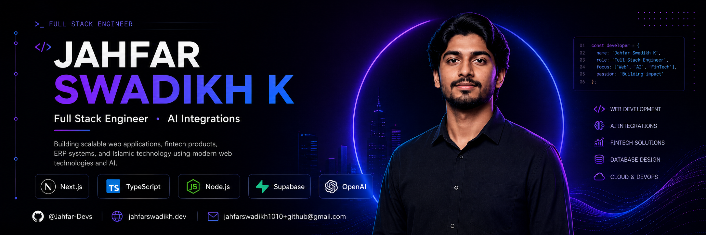
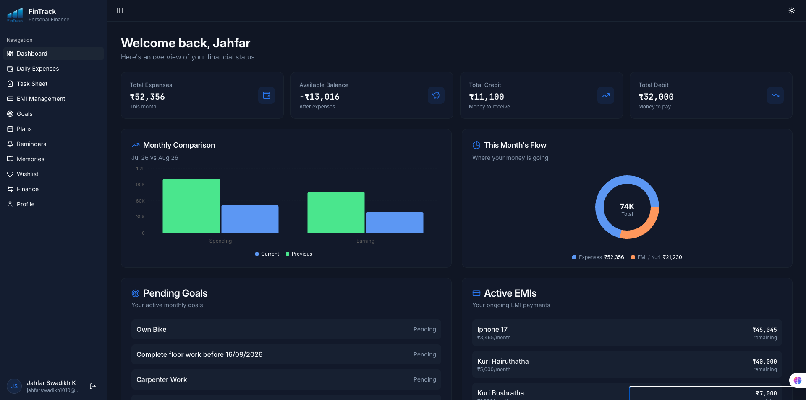
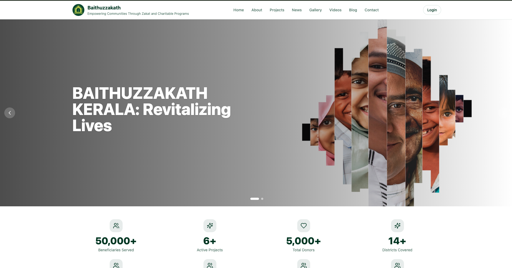
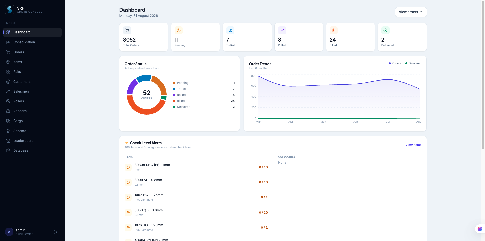
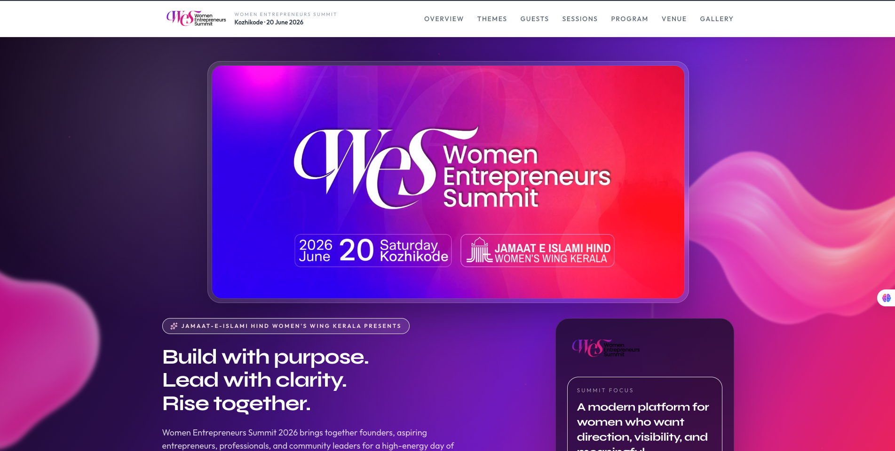
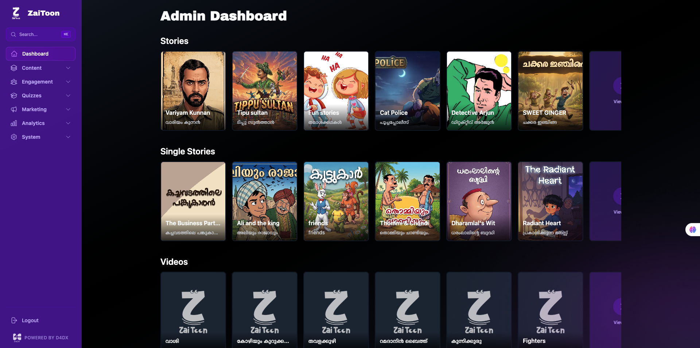

  

<h1 align="center">
  Hi  I'm
   
  
</h1>

  Building scalable web applications, fintech products, ERP platforms, and AI-powered Islamic technology with modern web technologies.

  

  

  

  

---

###  About Me

- 💼 Full Stack Engineer at **D4DX Innovations LLP**
- 🌍 Based in Kerala, India.
- 🤖 Building AI-powered applications using OpenAI, Gemini, and modern LLM workflows.
- 🧩 Passionate about Next.js, TypeScript, backend architecture, and automation.

---

## 🚀 Featured Projects

<table>
<tr>
<td width="50%" valign="top">

### 💰 FinTrack

AI-powered personal finance management platform.

**Tech:** Next.js • Node.js • Supabase • Gemini AI

Smart expense tracking, budgeting, AI financial insights, and analytics dashboard.

</td>

<td width="50%">

</td>
</tr>

<tr>
<td width="50%" valign="top">

### 🏢 People's ERP

Modern ERP platform for educational institutions.

**Tech:** Next.js • TypeScript • Express • MongoDB

Student management, attendance, growth tracking, coordinators, and reporting dashboard.

</td>

<td width="50%">

</td>
</tr>

<tr>
<td width="50%" valign="top">

### 📊 SRF

Internal workflow and operations management platform.

**Tech:** Next.js • Supabase • PostgreSQL

Role-based workflows, approvals, reports, and internal management tools.

</td>

<td width="50%">

</td>
</tr>

<tr>
<td width="50%" valign="top">

### 👩 WES — Women's Entrepreneurs Summit

Official summit website and management platform.

**Tech:** Next.js • Cloudflare • TypeScript

Event registration, speaker management, schedules, announcements, and responsive landing pages.

</td>

<td width="50%">

</td>
</tr>

<tr>
<td width="50%" valign="top">

### 🎬 Zaitoon Kids OTT

Streaming platform for Islamic children's content.

**Tech:** Next.js • Node.js • Video Streaming

Kids-first OTT experience with categorized videos, authentication, and responsive playback.

</td>

<td width="50%">

</td>
</tr>
</table>

---
## 📈 GitHub Analytics

  
  

  

## 📅 Contribution Graph

  

---

## 🌟 Current Projects

- 💸 **FinTrack** — AI-powered personal finance management platform.
- 🏫 **SRF Platform** — Education management and ERP system.
- 👥 **People ERP** — HR and attendance management platform.
- 📖 **Lalithasaram** — Malayalam Quran platform with audio and tafseer.

---

## 🌱 Currently Learning

- AI Agents
- Advanced RAG Pipelines
- Scalable Backend Architecture
- Cloud Infrastructure

---

## 📫 Connect With Me

- GitHub: **@Jahfar-Devs**
- Email: **jahfarswadikh1010+github@gmail.com**
